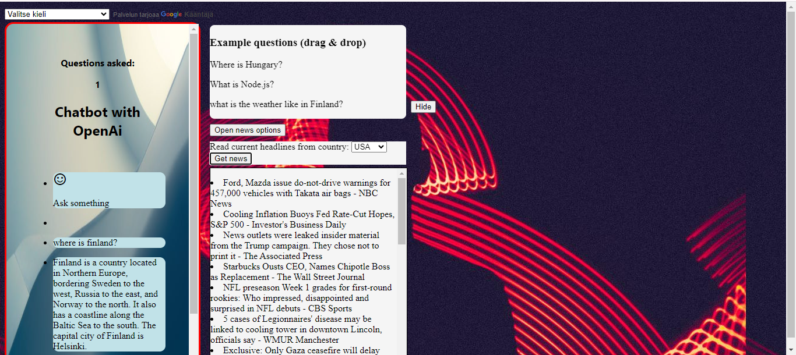

Project keywords: JavaScript, AI, HTML, CSS, API, Google Translate API.

A JavaScript chatbot and news feed application that uses OpenAI's GPT-3.5 Turbo API to generate responses for the user and Newsapi.org's HTTP REST API to generate a news feed for the user.

Example image of the user interface where the chatbot has been asked a question and at the same time news headlines from the USA have been retrieved.

CHATBOT

The program has a html interface with an input field where the user can write their question and send it by clicking the submit icon. The question is stored in a variable that the javaScript function sends to the OpenAi API in JSON format. The response from the API is retrieved using the JavaScript Fetch method.

News Feed

The news feed function has its own user interface, so you can use the chatbot and the news feed at the same time or separately.

The news feed is retrieved using the newsapi.org Http Rest API. The working principle is very similar to the Chat GPT API described above. The News API response displays the data in a array, so they are looped through in a forEach loop and displayed in a li-element, and each news item gets its own li-element using the JavaScript createElement method.

For now, the news feed is available by country. The country is selected from the html-select component and the selection is passed as a parameter to the function that implements the api call.

Translate

The application includes the Google Translate API, so you can translate the user interface and the chatbot's response to any language that google translate supports. By default, all answers will be in English.

Drag & Drop feature

index.html contains a div element with a few sample questions. Questions can be dragged and dropped into the text area and sent as questions to Open AI's API. This feature is made with HTML Drag and Drop API.

Example question div element can also hide on button click and show again on second click. this is done using Jquery's hide and show methods.

