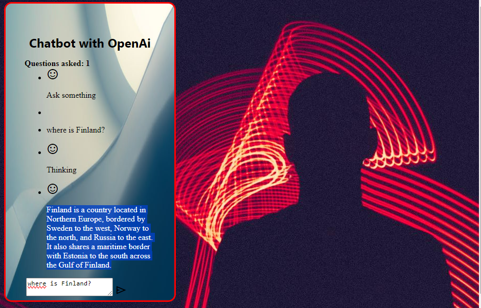

Project keywords: JavaScript, AI, HTML, CSS.
A JavaScript chatbot that uses OpenAI's GPT-3.5 Turbo API to generate responses for the user.

The program has a small html interface with an input field where the user can write their question and send it by clicking the submit icon. OpenAI generates the response and displays it in the user interface.

