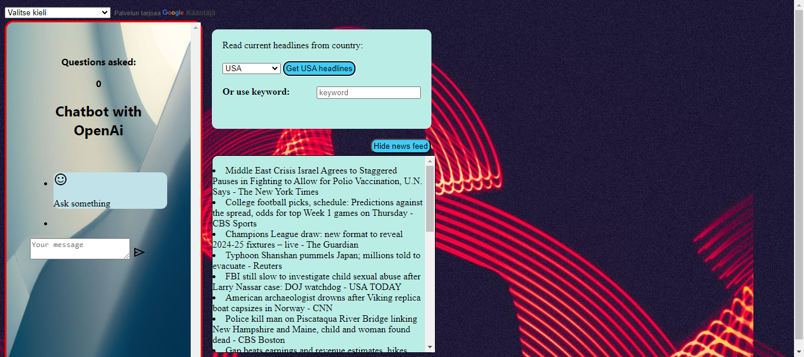

Project keywords: Vanilla-JavaScript, AI, HTML, CSS, API, jQuery. 

A JavaScript chatbot and news feed application that uses OpenAI's GPT-3.5 Turbo API to generate responses for the user and Newsapi.org's HTTP REST API to generate a news feed for the user.

The main idea of ​​combining the GPT interface and the news feed is that the user can ask the artificial intelligence for additional information on news topics.

An example picture where current news headlines have been searched by limiting the target country to the USA.

Example image, where news is searched for from the News API using the keyword (Apple) starting on August 1, 2024.

CHATBOT

The program has a html interface with an input field where the user can write their question and send it by clicking the submit icon. The question is stored in a variable that the javaScript function sends to the OpenAi API in JSON format. The response from the API is retrieved using the JavaScript Fetch method.

Example picture of the chatbot user interface and asking a question and receiving an answer

NEWS FEED

The news feed function has its own user interface, so you can use the chatbot and the news feed at the same time or separately.

The news feed is retrieved using the newsapi.org Http Rest API. The working principle is very similar to the Chat GPT API described above. The News API response displays the data in a array, so they are looped through in a forEach loop and displayed in a li-element, and each news item gets its own li-element using the JavaScript createElement method.

For now, the news feed is available by country, keyword and date search.
The country is selected from the html-select component and the selection is passed as a parameter to the function that implements the api call. The country feature displays 20 current news feeds from the selected country.

The keyword search is started by entering the keyword in the input field. the input field has an onChange event handler that displays the hidden button element if at least one character is typed into the input field. The search is started by clicking the button that appears.
The keyword is passed as a parameter to the newsAPI URL.

Date search. The user can enter the start date in the input field. The News API requires a date in the format YYYY-MM-DD. Since form is important, I used two methods to guide the user in spelling.

The first way is to use a placeholder and the second way is the jQuery Masking plugin.
The masking plugin automatically adds a hyphen in the right place, i.e. the first hyphen is added after 4 characters and the remaining hyphens after 2 characters.

Translate

The application includes the Google Translate API, so you can translate the user interface and the chatbot's response to any language that google translate supports. By default, all answers will be in English.

An example picture of the chatbot's response translated into Finnish using the Google Translate API.
The API integration can be seen in the upper left of the picture, where you can choose the translation language you want.

